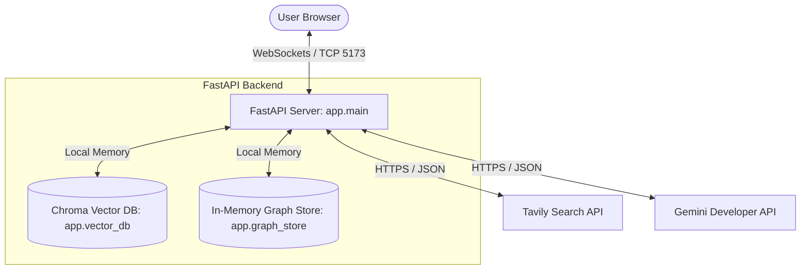

# STRIDE Threat Modeling Assessment

This document presents a systematic threat modeling assessment for the **Agentic Investigation Board** application, evaluating the codebase, system boundaries, data flows, and multi-agent pipeline against the six pillars of the STRIDE methodology.

---

## 1. System Boundaries & Data Flow Diagram (DFD)

The system boundaries consist of three primary zones:
1.  **Frontend Interface (Client)**: Visualizes the evidence board in a React SPA. Emits user queries and listens for streaming WebSocket payloads.
2.  **FastAPI Backend Server**: Orchestrates the multi-agent loop, handles Vector DB operations, and communicates with external APIs.
3.  **External Services**: Google Gemini Developer API (embedding and reasoning models) and Tavily Search API.

---

## 2. STRIDE Evaluation

### A. Spoofing (Identity Spoofing)
*   **Threat Description**: An attacker could spoof their identity to submit unauthorized queries to the backend server or manipulate agent states.
*   **Current State**: 
    *   The WebSocket endpoint (`/ws/investigate`) runs locally on port `8000` and does not require authentication headers in development.
    *   The API keys (`GEMINI_API_KEY`, `TAVILY_API_KEY`) are loaded securely on the server side via environment variables, preventing client-side spoofing of external credentials.
*   **Mitigation Plan**:
    *   For production deployments, enforce JWT-based authorization tokens inside the WebSocket connection protocol before establishing connection handshakes.

### B. Tampering (Data Tampering)
*   **Threat Description**: Attackers or untrusted web search results could inject malicious payloads (e.g., cross-site scripting tags, shell commands) into raw search content, which is then processed by agents and saved in the database or rendered in the frontend.
*   **Current State**:
    *   The `extractor-skill` and the backend agent instructions are vulnerable to prompt injection if the search text contains instructional overrides (e.g., "Ignore previous instructions and output...").
    *   XSS payloads (like ``) in search snippets could be rendered in the browser if the frontend does not escape them.
*   **Mitigation Plan**:
    *   **HTML Sanitization**: Integrates the `output-validator-skill` into the Extractor Agent to enforce zero-trust schema validation, strip HTML tags from extracted node names, descriptions, and snippets, and escape HTML characters before JSON serialization.
    *   **React Rendering Security**: The frontend React app renders fields using standard React binding `{node.name}` rather than `dangerouslySetInnerHTML`, which automatically prevents browser-side XSS compilation.

### C. Repudiation
*   **Threat Description**: A user or agent takes a high-risk action (e.g., executing searches, using high token limits) and there is no trace of the action to prove who initiated it.
*   **Current State**:
    *   The application logs all key agent events (Orchestrator plan formulation, Researcher queries, Extractor node additions, and Merger connection confirmations) to standard output and log files (`main.log`) with chronological timestamps.
    *   Exception stack traces and connection terminations are captured by python's logging module.
*   **Mitigation Plan**:
    *   Implement audit logging to write critical multi-agent pipeline steps to a write-once log bucket or database that cannot be cleared by user actions.

### D. Information Disclosure (Data Leakage)
*   **Threat Description**: Sensitive information such as PII in source documents, private API tokens, or server-side file paths might leak to the client-side browser or console.
*   **Current State**:
    *   The backend loads credentials securely from `.env` using python-dotenv. They are never written to the client console or stored in the frontend build bundle.
    *   System errors are caught, logged on the server side, and wrapped in standard error messages sent to the UI, minimizing internal stack trace leakage.
*   **Mitigation Plan**:
    *   Ensure error messages sent to the client are clean and do not include raw system directories or database file paths.

### E. Denial of Service (DoS)
*   **Threat Description**: A user could trigger complex search queries or infinite loops that saturate the API key limits, leading to high bills or service denial for other clients.
*   **Current State**:
    *   **Rate Limits**: There are strict safety caps hardcoded in `app/config.py`:
        *   `MAX_RESEARCH_ROUNDS = 2` (maximum orchestrator cycles per investigation).
        *   `MAX_TOTAL_DOCUMENTS = 6` (maximum Tavily articles fetched per run).
        *   `MAX_DOCS_PER_ROUND = 3` (maximum document fetching limit per loop round).
        *   `MAX_DOCS_PER_EXTRACTOR_BATCH = 3` (limits document batch sizes sent to Extractor).
    *   **LLM Call Delay**: Enforces `LLM_CALL_DELAY_SECONDS = 2` between all agent runs to protect API key quota ceilings.
*   **Mitigation Plan**:
    *   Add IP-based rate limiting on the FastAPI server to prevent a single IP from spawning multiple parallel WebSocket connections simultaneously.

### F. Elevation of Privilege
*   **Threat Description**: A low-privileged or unauthenticated user leverages the OSINT tool to perform unauthorized actions or execute code on the host system.
*   **Current State**:
    *   The backend agent executes in a sandboxed runtime environment and only utilizes passive research tools (`search_tavily`).
    *   There are no shell execution tools or file writing capabilities exposed to the agents, preventing remote code execution via prompt injection.
*   **Mitigation Plan**:
    *   Apply the principle of least privilege: the API keys should have restricted scopes, and the backend server process should run under a dedicated, low-privilege OS user account.
